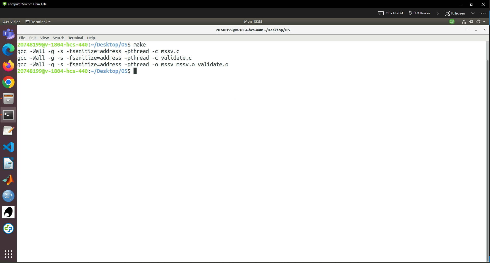
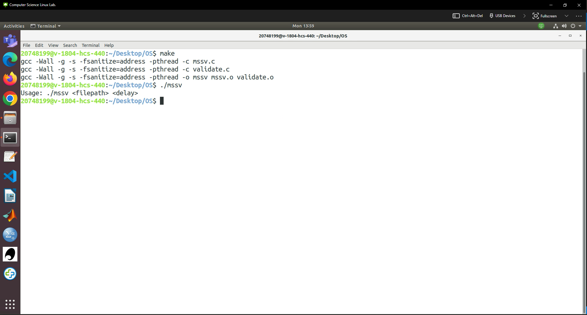
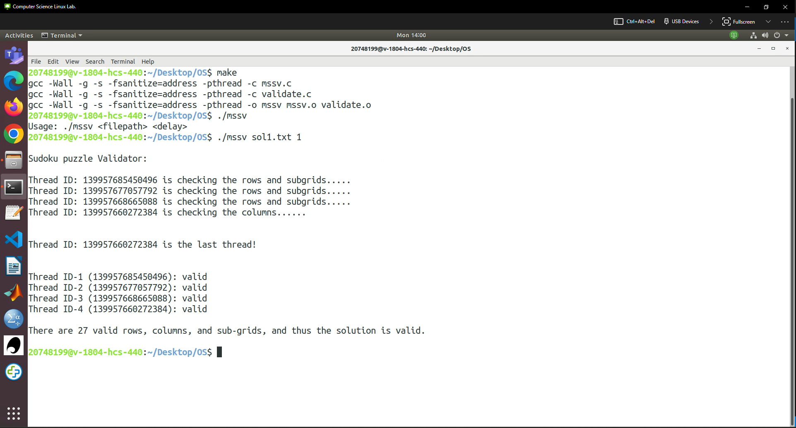

**
README
**

# Synopsis

**AUTHOR** : Sauban Kidwai

**STUDENT ID** : 20748199

**DESCRIPTION** : COMP2006 - Operating Systems 

 

# How to run the program
To run the program, locate the directory where the assignment is located. This is assuming that the program will be run in a Linux Environment

1. Open a terminal within the directory and type in the command `make clean` and then press enter to make sure that any object files or unnecessary files are deleted.

2. Then type in the command `make` and press enter. The program will now compile

3. Then to run the program, type in the command `./mssv` and press enter. The program will display the usage of the program

4. Then, type in the correct command. In this case `./mssv sol1.txt 1`. Please note the file name ranges from `sol1.txt` to `sol5.txt` and delay ranges from 1 to 10.

5. Thats it! The program has been executed successfully.

# File Contents
 

| **File**   | **Description**                                                                        |
|------------|----------------------------------------------------------------------------------------|
|  makefile  | Contains the code required to compile and run the program                              |
|   mssv.c   | Contains the Main function for the Assignment                                          |
| validate.c | Contains the Validation functions for the Assignment                                   |
|  sudoku.h  | Header File containing global variables to be shared between `validate.c` and `mssv.c` |
|  sol1.txt  | Contains one example of a correct Sudoku Solution                                      |
|  sol2.txt  | Contains one example of a Correct Sudoku Solution                                      |
|  sol3.txt  | Contains one example of an Incorrect Sudoku Solution                                   |
|  sol4.txt  | Contains one example of an Incorrect Sudoku Solution                                   |
|  sol5.txt  | Contains an example of an incorrect Sudoku Grid Size                                   |
